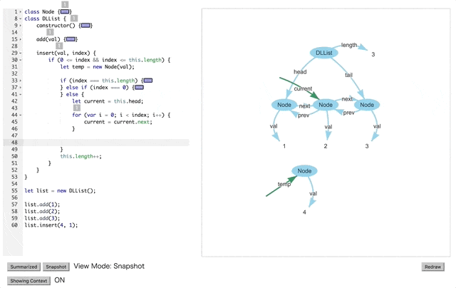

# Kanon

__Kanon__ is a live programming environment for data structures.
While you write JavaScript code in the editor on the left-hand side,
the data structures constructed during the execution of the code appears as a graph on the right-hand side.



## How to use

Kanon runs on your browser.  Open the following page: [https://prg-titech.github.io/Kanon/](https://prg-titech.github.io/Kanon/).

## How to build

To build __Kanon__ in your local environment,
execute the following command.
```
git clone --recursive https://github.com/prg-titech/Kanon.git
```
This will copy the source code of Kanon as well as the external libraries.
After downloaded, go to the Kanon directory and execute the following command.

```
npm install
```

Then, you can open [index.html](https://github.com/prg-titech/Kanon/blob/master/index.html) in your browser.

You can also use __Kanon__ by desktop application.

```
npm start
```

## Samples

it is recommended that you try to use sample code that is in [samples](https://github.com/prg-titech/Kanon/tree/master/samples) directory if you have never used Kanon.

---

## Notes

__Kanon__ uses the following libraries.

- [vis.js](http://visjs.org) (https://github.com/almende/vis)

- [Ace](https://ace.c9.io) (https://github.com/ajaxorg/ace)

- [esprima](http://esprima.org) (https://github.com/jquery/esprima/tree/3.1.1)
  [*]

- escodegen (https://github.com/estools/escodegen)


## References

- Live Editor (https://github.com/Khan/live-editor)

## LICENSE

Kanon is distributed under the MIT License. See [LICENSE](https://github.com/prg-titech/Kanon/blob/master/LICENSE) for more information.

[*]: Our repository includes esprima.js in the externals directory, which is taken from https://unpkg.com/esprima@3.1.1/dist/esprima.js .

